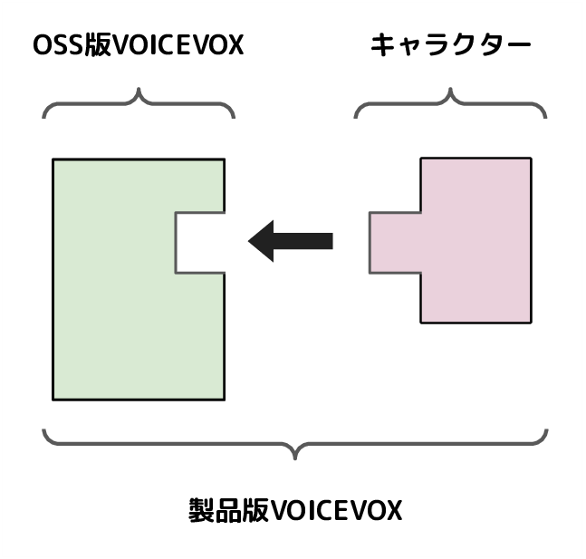

# 全体構成

VOICEVOX では、キャラクターの要素（声や見た目）を含まない OSS 版と、OSS 版をもとに構築してキャラクターの要素を含めた製品版を分けて開発・配布しています。

<!-- 修正時はエディタ側のドキュメントも要修正 -->
<!-- https://github.com/VOICEVOX/voicevox/blob/main/docs/全体構成.md -->

## 全体構成

VOICEVOX は役割に応じた 3 つのモジュール「エディター」「エンジン」「コア」で構成されています。VOICEVOX ソフトウェアはこの 3 つのモジュールを組み合わせて構成されていて、エディターはエンジンを参照し、エンジンはコアを参照しています。

<!-- 修正時はエディタ側のドキュメントも要修正 -->
<!-- https://github.com/VOICEVOX/voicevox/blob/main/docs/全体構成.md -->
