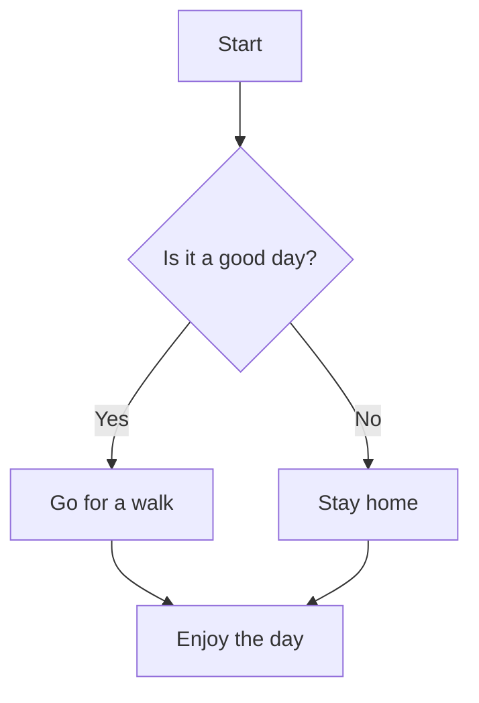

# VOICEVOX Docs

（TODO：良い感じの歓迎文章を書く）

> [!WARNING]
> これはVOICEVOXを利用する開発者向けのドキュメントです。\
> 一般ユーザー向けの情報は[VOICEVOXの公式サイト](https://voicevox.hiroshiba.jp/)をご覧ください。

このようなことをしたい場合は[エンジン](./engine/)を使うと良いでしょう。

- （TODO1）
- （TODO2）

このようなことをしたい場合は[コア](./core/)を使うと良いでしょう。

- （TODO3）
- （TODO4）

## Mermaid Test

